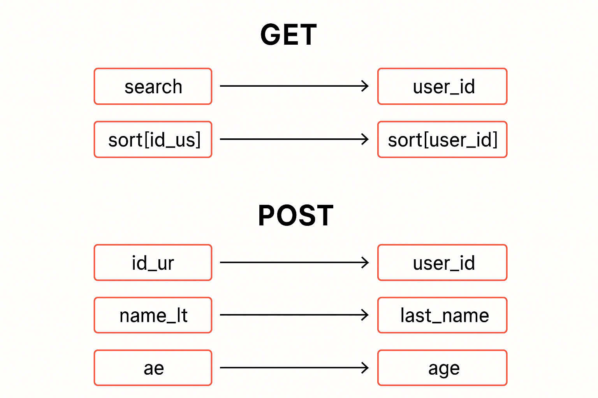

## 🌐 Multilingue | Multilingue

- 🇫🇷 [Version Française](README.fr.md)
- 🇬🇧 [English Version](README.md)

## 🇫🇷 Français

# Kjos Laravel Parameter Mapper

Un package Laravel qui permet de mapper dynamiquement les paramètres GET et POST envoyés par le client vers les clés backend de votre application, et inversement. Pratique pour cacher les vrais noms de champs à l’utilisateur ou pour standardiser vos API.

---

## Installation

Pour Laravel 12 ou supérieur :

```bash
composer require kjos/kjos-laravel-parameter-mapper
```

## Publier la configuration

```bash
php artisan vendor:publish --tag=parametermap
```

## Configuration

```php
return [
    'map' => [
        // frontParam => backendParam
        'id_ur'   => 'user_id',
        'name_lt' => 'last_name',
        'ae'      => 'age',
    ],

    // Valeurs spécifiques à mapper (ex: search=id_us => search=user_id)
    'values-to-map' => [
          'search',
    ],
    
    // Mapper les clés dans des tableaux (ex: sort[id_us] => sort[user_id])
        'array-keys-to-map' => [
            'sort',
        ],

        'reject-knowns' => true,
];
```

## Middleware

```php
use Kjos\ParameterMapper\Middleware\MapRequestParameters;
Route::middleware([MapRequestParameters::class])
```

## Classe `ParameterMapper`

```php
use Kjos\ParameterMapper\Support\ParameterMapper;

// Mapper front -> back
$mapped = ParameterMapper::apply([
    'id_ur' => 1,
    'name_lt' => 'Koffi',
    'ae' => 10,
    'sort' => ['id_ur' => 'asc'],
    'search' => 'id_ur',
]);

// Mapper back -> front
$frontend = ParameterMapper::reverse([
    'user_id' => 1,
    'last_name' => 'Koffi',
    'age' => 10,
    'sort' => ['user_id' => 'asc'],
    'search' => 'user_id',
]);
```

## Utilisation dans les Factories

```php
    $datas = ParameterMapper::reverse([
      'user_id' => 1,
      'last_name' => 'Koffi',
      'age' => 10,
    ]);
```
Devient:
```php
    [
      'id_ur' => 1,
      'name_lt' => 'Koffi',
      'ae' => 10,
    ]
```


## Exemple API

Requête :

```
GET /api/admins?search=id_us&sort[id_us]=asc
```

Transformée automatiquement en :

```php
[
    'search' => 'user_id',
    'sort' => ['user_id' => 'asc']
];
```

## 🔒 reject-knowns — Rejeter les paramètres internes
Le paramètre reject-knowns permet de rejeter automatiquement toute requête qui contient un paramètre correspondant à une clé backend interne.

Objectif

Empêcher les utilisateurs d’envoyer directement des noms de champs backend (internes) qui sont normalement cachés derrière la map front → back.
Par exemple, si tu as cette map :
```php
'map' => [
    'id_ur'   => 'user_id',
    'name_lt' => 'last_name',
    'ae'      => 'age',
],
```
et que reject-knowns est activé :
```php
'reject-knowns' => true,
```
Alors une requête comme :

```GET /api/admins?user_id=1```
sera rejetée avec une erreur HTTP 404, car user_id est un paramètre interne et ne doit pas être exposé côté front.

### Comment l’activer

Dans le fichier de configuration config/parameter-mapper.php
```php
<?php

return [
    'map' => [
        'id_ur'   => 'user_id',
        'name_lt' => 'last_name',
        'ae'      => 'age',
    ],

    // Rejeter les paramètres backend connus
    'reject-knowns' => true,
];
```

### Mapper la réponse

Dans le fichier config/parameter-mapper.php
```php
<?php

return [
'map' => [
    ...
],

// Va activer le mapping de la réponse
'map-response' => true,
];
```

## Schema



# 📁 Directory Structure
```
project-root/
   ├── CHANGELOG.md
   ├── LICENSE
   ├── README.md
   ├── composer.json
   ├── composer.lock
   ├── config
   │   └── parameter-mapper.php
   ├── grumphp.yml
   ├── phpunit.xml
   ├── pint.json
   ├── schema.png
   ├── src
   │   ├── Middleware
   │   ├── ParameterMapperServiceProvider.php
   │   └── Support
   ├── tests
   │   ├── ExampleTest.php
   │   ├── Feature
   │   ├── Pest.php
   │   ├── TestCase.php
   │   └── Unit
```


# 👤 Auteur
Maintenu par [Jean Koffi](https://www.linkedin.com/in/konan-kan-jean-sylvain-koffi-39970399/)

# 📄 Licence
MIT © kjos/kjos-laravel-parameter-mapper

# 🤝 Appel à contributions

Ce projet est ouvert aux contributions !

Vous êtes développeur, passionné par Laravel ou intéressé par l’architecture multi-tenant ?

- Forkez le projet

- Créez une branche (klpm/my-feature)

- Soumettez une pull request 🧪